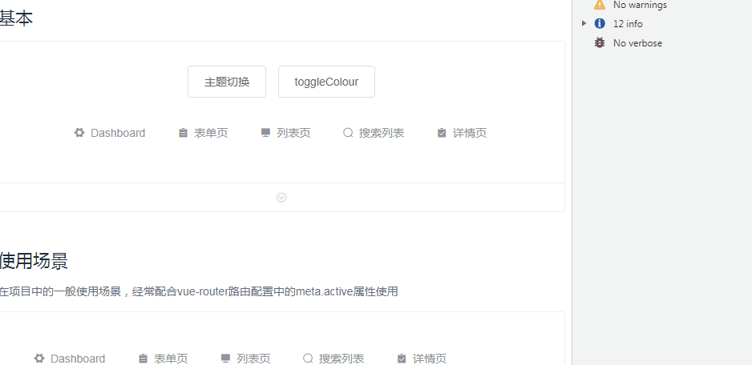

# reactive-navigation-bar

>  a reactive navigation bar component that's based on [element-ui](https://github.com/ElemeFE/element). IE compatible

## Install

```bash
npm install reactive-navigation-bar -S
```

## Quick Start

```bash
import Vue from 'vue'
import ReactiveNavigationBar from 'reactive-navigation-bar'
# Vue.component('reactive-navigation-bar', ReactiveNavigationBar) # 可以指定组件名称
Vue.use(ReactiveNavigationBar) # 组件名称 `reactive-navigation-bar`
```

For more information, please refer to [ReactiveNavigationBar](https://github.com/BoldArialBlack/reactive-navigation-bar.git) in our documentation.

## Build Setup

``` bash
# install dependencies
npm install

# serve with hot reload at localhost:8080
npm run dev

# build for demo with minification
npm run demo:build

# build for gh-pages with minification
npm run demo:prepublish

# build for production with minification
npm run build

# generate gh-pages
npm run deploy
```

## LICENSE

[MIT](http://opensource.org/licenses/MIT)

## 截图



## 基本用法
```
<template>
  <div class="vd-demo__block vd-demo__block-2">
    <reactive-navigation-bar
      :theme="theme"
      :data="dataList"
      :theme-color="color"
      width="calc(100% - 100px)"
    />
  </div>
</template>
```
```
<script>

<script>
  export default {
    data () {
      return {
        theme: 'light',
        dataList: [],
        color: '#1890ff'
      }
    },
    mounted() {
      this.dataList = [
        {
          title: 'Dashboard',
          hide: false,
          path: '1',
          icon: 'el-icon-s-tools',
          children: [
            {
              title: '分析页',
              hide: false,
              icon: 'el-icon-star-off',
              path: '1.1',
              disabled: true
            },
            {
              title: '监控页',
              icon: 'el-icon-s-operation',
              path: '1.2',
              hide: false
            },
            {
              title: '工作台',
              icon: 'el-icon-s-cooperation',
              path: '1.3',
              hide: false
            }
          ]
        },
        {
          title: '表单页',
          hide: false,
          icon: 'el-icon-s-order',
          children: [
            {
              title: '数据管理对象长长长长长长长',
              hide: false,
              path: '2.1',
              children: [{
                title: '数据管理对象长长长长长长长',
                hide: false,
                path: '2.1.1'
              }]
            },
            {
              title: '分步表单',
              hide: false,
              path: '2.2',
              children: [{
                title: '数据管',
                hide: false,
                path: '2.2.1'
              }]
            },
            {
              title: '高级表单',
              hide: false,
              path: '2.3'
            }
          ]
        },
        {
          title: '列表页',
          hide: false,
          path: '3',
          icon: 'el-icon-s-platform'
        },
        {
          title: '搜索列表',
          hide: false,
          path: '4.1',
          icon: 'el-icon-search',
          children: [
            {
              title: '搜索列表(文章)',
              hide: false,
              path: '4.1.1'
            },
            {
              title: '搜索列表(应用)',
              hide: false,
              disabled: true,
              path: '4.1.2'
            },
            {
              title: '搜索列表(项目)',
              hide: false,
              path: '4.1.3'
            }
          ]
        },
        {
          title: '详情页',
          hide: false,
          disabled: true,
          path: '5',
          icon: 'el-icon-s-claim'
        }
      ];
    },

    methods: {
      toggleColor() {
        if (this.color === '#ffd04b') {
          this.color = '#1890ff';
        } else {
          this.color = '#ffd04b';
        }
      },
      toggle() {
        if (this.theme === 'light') {
          this.theme = 'dark';
        } else {
          this.theme = 'light';
        }
      }
    }
  }
</script>
```

## ReactiveNavigationBar props

| 参数   | 说明  | 类型  | 可选值  | 默认值  |
|----------|---------|---------|-----------|-----------|
| data | 菜单 | Array  | - | - |
| default-active | 默认选中项 | String  | - | - |
| route-mode | 是否菜单选中只与当前路由route有关 | Boolean  | - | false |
| trigger | 子菜单浮窗触发方法 | String  | hover, click | hover |
| theme | 主题 | String  | light, dark | light |
| theme-color | 主题颜色 | String  | - | #52c41a |
| background-color | 背景颜色 | String  | - | 当主题为light时，默认为#e6f7ff; 当主题为dark时，默认为#24292e |
| align | 主菜单排列方式 | String  | fixed, fluid | fluid |
| width | 主菜单宽度 | Number, String  | - | - |
| bar-height | 主菜单高度 | Number, String  | - | 56 |
| menu-height | 子菜单高度 | Number, String  | - | 32 |
| arrow | 是否在主菜单内显示箭头 | Boolean  | - | true |
| bar-background-active | 子菜单选中时是否改变主菜单背景颜色 | Boolean  | - | false |
| underline | 选中时是否有下划线效果 | Boolean  | - | true |
| append-to-body | 悬浮子菜单是否挂载到body上 | Boolean  | - | true |
| strict-align | 子菜单宽度是否对齐主菜单 | Boolean  | - | true |

## ReactiveNavigationBar events
| 事件名称   | 说明  | 回调参数  |
|----------|---------|---------|
| select | 菜单被选中时的事件 | item, index, indexPath, event |
| open | 开启子菜单浮窗的事件 | item, index, indexPath |
| close | 关闭子菜单浮窗的事件 | item, index, indexPath |

## ReactiveNavigationBar data item prop
| 名称   | 说明  | 类型  | 可选值  | 默认值  |
|----------|---------|----------|---------|---------|
| icon | 图标 | String | - | - |
| title | 标题 | String | - | - |
| path | 路由 | String | - | - |
| hide | 是否隐藏 | Boolean | - | false |
| disabled | 是否禁用 | Boolean | - | false |
| children | 子菜单数据 | Array[Object] | - | [] |
| meta | 辅助性属性(内含index时，index内容与是否选中有关) | Object | - | - |

## 更新日志
- `v1.1.1`: 路由跳转兼容IE浏览器; 添加routeMode属性，支持纯路由的选中判断
